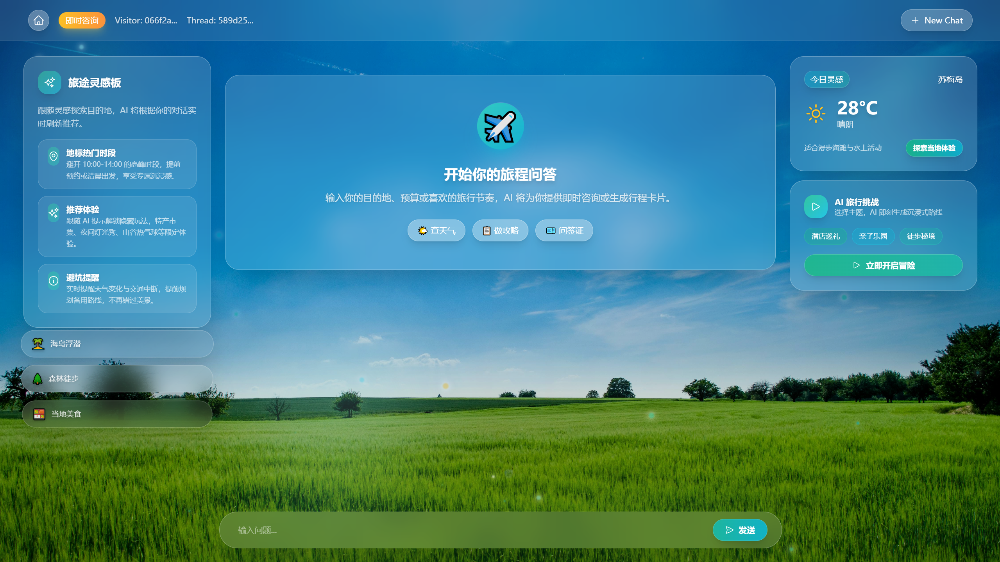
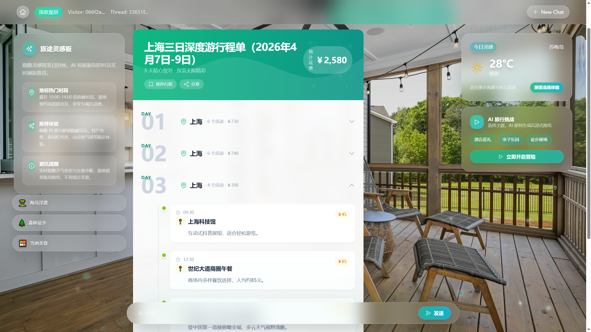
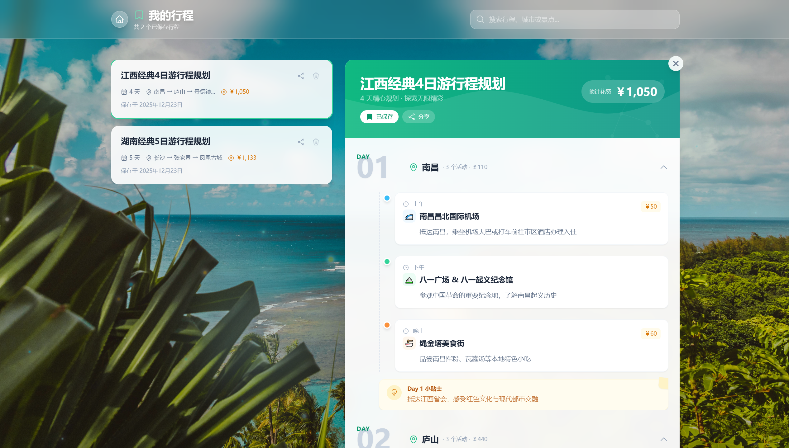
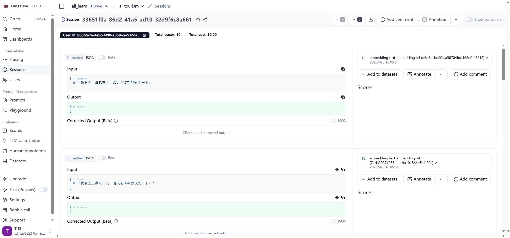
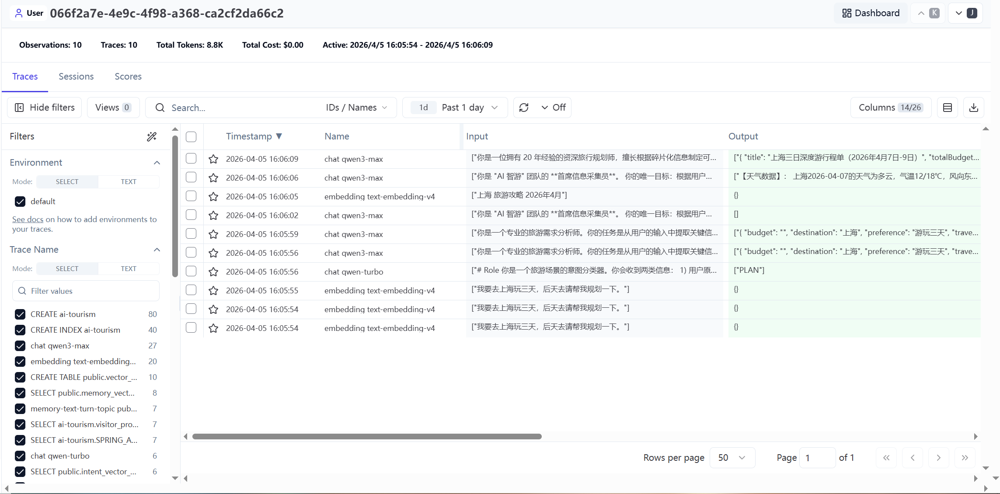
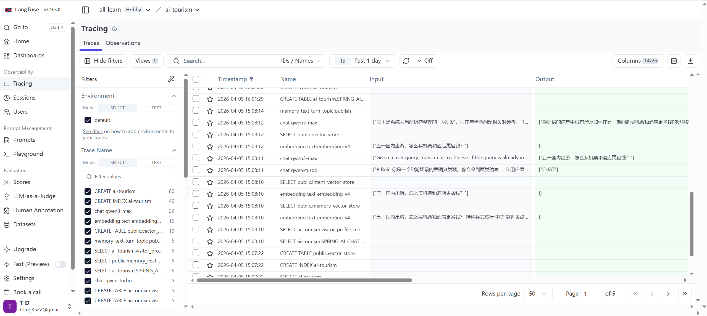

# AI Intelligent Tourism

一个基于 Spring AI + Spring Boot + Vue 3 的智能旅游助手项目，支持：

- 普通问答（Chat）
- 行程规划（Plan）
- 政策查询（Policy）
- RAG 知识检索（PGVector）
- 记忆系统（Working Memory / Long-Term Memory）
- 可观测性追踪（OpenTelemetry + Langfuse）

## 项目结构

```text
ai-intelligent-tourism/
├─ src/                          # Java 后端
├─ intelligent-tourism-fronted/  # Vue 前端
├─ docs/
├─ pom.xml
└─ README.md
```

## 插图















---

## 技术栈

### 后端

- Java 21
- Spring Boot 3.4.x
- Spring AI 1.1.x
- Spring AI Alibaba（DashScope）
- Spring Kafka
- PostgreSQL + PGVector
- OpenTelemetry + Micrometer

### 前端

- Vue 3
- Vite
- TypeScript
- Pinia
- Vue Router
- Tailwind CSS

---

## 环境要求

- JDK 21
- Maven 3.9+
- Node.js 18+
- PostgreSQL（建议安装 pgvector 扩展）
- Kafka（用于记忆事件）

## 快速启动

### 1) 启动后端

```powershell
cd D:\Forksourcefolder\java_project\ai-intelligent-tourism
.\mvnw.cmd spring-boot:run
```

后端默认地址：`http://localhost:8120/api`

### 2) 启动前端

```powershell
cd D:\Forksourcefolder\java_project\ai-intelligent-tourism\intelligent-tourism-fronted
npm install
npm run dev
```

前端通常为：`http://localhost:5173`

---

## 配置说明（重要）

### 1) Kafka 需要你自己配置

本项目记忆系统会使用 Kafka 发布/消费事件，请按你的环境修改：

- `src/main/resources/application.yml` 中 `spring.kafka.*`
- `bootstrap-servers`
- consumer group、序列化配置等

如果 Kafka 未正确配置，记忆事件链路会异常（例如消息无法发布/消费）。

### 2) Langfuse / OTel 需要你自己配置

本项目已接入 OTel 观测，并在代码里补充了 Langfuse 字段（如 `langfuse.observation.input/output`、`langfuse.user.id/session.id`）。

你需要自行配置：

- OTLP 上报地址
- Authorization 头
- `x-langfuse-ingestion-version`

对应位置：

- `src/main/resources/application.yml` 的 `otel.exporter.otlp.traces.*`

如果这部分不配置，应用可运行，但 Langfuse 中不会出现完整链路。

---

## 常用接口

- Graph 对话：`POST /api/ai/tourism_app/chat/manus`
- 流式对话：`GET /api/ai/tourism_app/chat/sse_emitter`

接口文档（Knife4j）：

- `http://localhost:8120/api/swagger-ui.html`

---

## 开发建议

- 本地敏感配置建议放在 `application-local.yml`
- 调试观测链路时，先确认：
  - Kafka 可连通
  - PostgreSQL + pgvector 正常
  - OTel OTLP 地址与密钥有效

---

## License

仅用于学习与开发演示。

